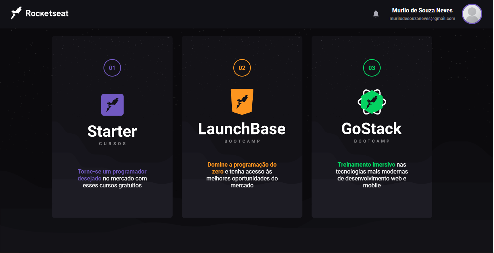

<h1 align="center">Dashboard Clone 👊</h1>

<p> 
    
</p>

## Getting Started :computer:

# Make a clone of the repository: :robot:

```sh
git clone https ://github.com/muNeves3/Dashboard
```

# Go to the directory ↪️

```sh
cd Dashboard
```

# Install the dependencies: :rocket:

```sh
npm install
```

# Run the app :rocket:

```sh
yarn start
```

## How to contribute? 🤔

<ul> 
    <li>Fork this repository</li>
    <li>Change what you think is best</li>
    <li>Make a pull request</li>
</ul>
